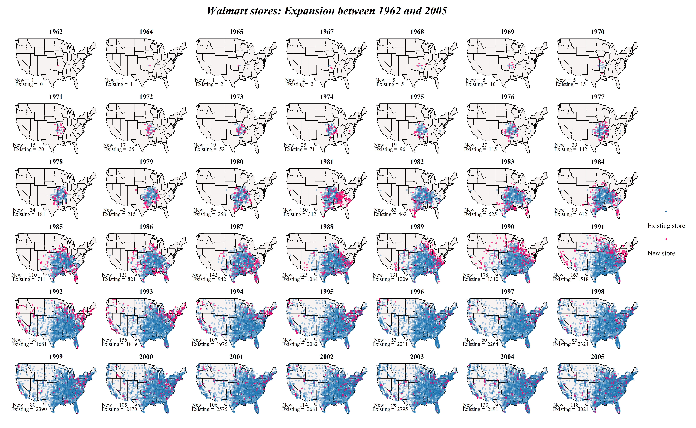

# Data visualization with small multiples

R and ggplot2 really shine when it comes to produce small-multiples (faceting). This repository contains code + data to reproduce the following chart:

This is a reproduction of a chart first published in [this interesting article] (http://www.excelcharts.com/blog/animation-small-multiples-growth-walmart-excel-edition/) about using animations versus small multiples.
